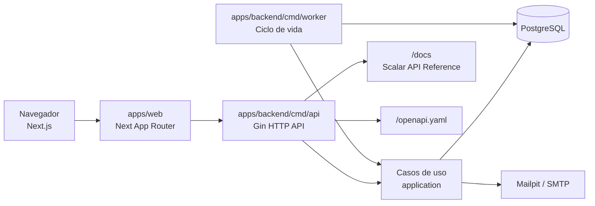

# Arquitetura do Cidadon

## Visão geral

O Cidadon é uma plataforma para registrar demandas regionais, acompanhar o atendimento público e permitir que gabinetes de vereadores atuem sobre elas. O repositório é um monorepo com três processos independentes: web, API e worker.



## Estrutura do repositório

| Caminho | Responsabilidade |
|---|---|
| `apps/backend/cmd/api` | Entrada do servidor HTTP. |
| `apps/backend/cmd/worker` | Processo assíncrono para concluir demandas com validação expirada. |
| `apps/backend/internal/domain` | Entidades e portas de repositório; não conhece HTTP ou banco. |
| `apps/backend/internal/application` | Casos de uso, DTOs, validação de regra e autorização. |
| `apps/backend/internal/adapters/http` | Rotas Gin, handlers e middleware de autenticação/erros. |
| `apps/backend/internal/adapters/persistence/postgres` | Modelos Gorm e adaptadores PostgreSQL. |
| `apps/backend/internal/adapters/external` | SMTP, JWT, hash, criptografia e enriquecimento de endereço. |
| `apps/backend/internal/platform` | Configuração, conexão/transação de banco e infraestrutura comum. |
| `apps/backend/internal/bootstrap` | Composição de dependências, migrações e registro de rotas. |
| `apps/backend/docs/openapi.yaml` | Contrato HTTP versionado da API. |
| `apps/web/src/app` | Rotas e composição de páginas Next.js. |
| `apps/web/src/features` | Funcionalidades por domínio: autenticação, demandas, gabinetes e notificações. |
| `apps/web/src/components` | Componentes compartilhados, layout e componentes UI. |
| `apps/web/src/lib` | Cliente HTTP, mapeamento de erros, formulários e utilidades. |
| `infra/compose` | Composição local de PostgreSQL e Mailpit. |

## Camadas do backend

| Camada | Regra | Exemplos |
|---|---|---|
| Domain | Representa o negócio e seus contratos. Não depende de Gin, Gorm ou SMTP. | `Demand`, `Office`, `User`, interfaces de repositório. |
| Application | Orquestra um caso de uso e aplica regras de autorização/transição. | assumir demanda, comentar, excluir comentário, convidar membro. |
| Adapters | Traduz o mundo externo para as portas do domínio. | handlers HTTP, Gorm/PostgreSQL, SMTP, JWT. |
| Platform | Serviços técnicos compartilhados. | leitura de `.env`, conexão PostgreSQL, transações. |
| Bootstrap | Cria dependências e monta a aplicação. | migrações, rotas e injeção de serviços. |

### Regra de dependência

```text
HTTP / PostgreSQL / SMTP ──> adapters ──> application ──> domain
                                  ↑
                           bootstrap compõe tudo
```

O worker não deve acessar modelos Gorm como regra de negócio. Ele chama o caso de uso de ciclo de vida da demanda, compartilhando as mesmas regras que a API.

## Frontend

O frontend usa Next.js App Router, TypeScript, Tailwind/shadcn e componentes por feature. As páginas em `src/app` são finas: compõem shells e telas. Chamadas HTTP, tipos e mapeamento de erros vivem em `src/lib/api` e `src/lib/forms`.

Mensagens internas do backend nunca são mostradas diretamente: a API devolve códigos estáveis e o frontend os converte para textos apropriados em toast ou erros de campo.

## Dados e fluxos importantes

| Recurso | Estado ou relação principal |
|---|---|
| Demanda | `registrada` → `em análise` → `em execução` → `aguardando validação` → `concluída`. |
| Atribuição | Uma demanda pode ser notificada a vários gabinetes; o primeiro a assumir torna-se responsável único. |
| Evento | Registro imutável de criação, atribuição, transições, moderação, exclusão e conclusão automática. |
| Comentário | Texto e/ou até cinco imagens; possui `parent_id` e no máximo um nível de resposta visual. |
| Comentário excluído | Somente o autor exclui; respostas diretas são excluídas na mesma transação e o evento auditável é preservado. |
| Notificação | Persistente por usuário e entregue por consulta e SSE. |
| Convite | Solicitação de membro por e-mail, token com expiração e cadastro concluído pelo convidado. |

## Segurança e autorização

| Papel | Capacidades principais |
|---|---|
| Cidadão | Registrar demandas, consultar demandas públicas, comentar, confirmar ou reabrir a própria demanda. |
| Vereador | Gerenciar o gabinete e a equipe; atuar nas demandas atribuídas ao gabinete. |
| Membro do gabinete | Atuar nas demandas do gabinete, sem assumir permissões exclusivas de gestão do vereador. |

Autenticação é baseada em cookies HTTP-only com JWT. Os handlers verificam o papel exigido; os casos de uso validam também autoria, gabinete responsável e estado atual antes de alterar dados.

## Processos de execução

| Processo | Comando local | Responsabilidade |
|---|---|---|
| API | `make api` | API HTTP, SSE, autenticação, OpenAPI e integrações. |
| Worker | `make worker` | Finaliza automaticamente demandas que ficaram 120 horas aguardando validação. |
| Web | `make web` | Interface Next.js em desenvolvimento. |
| Infraestrutura | `make infra-up` | PostgreSQL e Mailpit. |
| Todos | `make up` | Sobe infraestrutura, API, worker e web. |

## Documentação da API

| URL | Uso |
|---|---|
| `http://localhost:8080/openapi.yaml` | Contrato OpenAPI em YAML, para ferramentas e geração de clientes. |
| `http://localhost:8080/docs` | Referência interativa renderizada com Scalar. |

## Cenários de uso

### UC-01 — Cadastro e acesso do cidadão

| Campo | Detalhe |
|---|---|
| Atores | Cidadão, API. |
| Objetivo | Criar uma conta e acessar a área cidadã. |
| Pré-requisitos | E-mail ainda não cadastrado; campos obrigatórios válidos. |
| Gatilho | Cidadão escolhe criar conta ou efetua login. |
| Fluxo principal | 1. Informa nome, e-mail, senha, cidade e UF. 2. API valida e cria usuário/cidadão. 3. Usuário realiza login. 4. API cria cookies de sessão. 5. Frontend redireciona para a área cidadã. |
| Alternativas/exceções | E-mail duplicado retorna código de conflito; campo inválido é associado ao input; credenciais inválidas exibem toast mapeado pelo frontend. |
| Pós-condições | Conta e sessão do cidadão ativas. |

### UC-02 — Cadastro de vereador e criação de gabinete

| Campo | Detalhe |
|---|---|
| Atores | Vereador, API. |
| Objetivo | Criar identidade parlamentar e configurar o gabinete. |
| Pré-requisitos | E-mail livre; nome, partido, foto, cidade e UF informados. |
| Gatilho | Vereador seleciona cadastro de vereador. |
| Fluxo principal | 1. API registra usuário e perfil de vereador. 2. Vereador autentica-se. 3. Cria ou atualiza o gabinete. 4. Define descrição, região de atuação, contatos e redes sociais. |
| Alternativas/exceções | Dados inválidos ou e-mail já utilizado impedem o cadastro. Usuários sem papel de vereador não podem editar o gabinete. |
| Pós-condições | Perfil público do gabinete pode ser pesquisado por nome do vereador, partido ou região. |

### UC-03 — Convite e ingresso de membro do gabinete

| Campo | Detalhe |
|---|---|
| Atores | Vereador, convidado, SMTP/Mailpit, API. |
| Objetivo | Adicionar colaborador autenticado ao gabinete. |
| Pré-requisitos | Vereador autenticado e gabinete existente; e-mail do convidado válido. |
| Gatilho | Vereador envia um convite pela página Equipe. |
| Fluxo principal | 1. API gera token com expiração. 2. E-mail HTML identifica o gabinete convidante. 3. Convidado abre o link. 4. Frontend exibe o gabinete e solicita nome, foto e senha. 5. API valida token e cria o membro. |
| Alternativas/exceções | Convite expirado, cancelado ou já usado é recusado. E-mail repetido retorna conflito. |
| Pós-condições | Membro tem acesso às demandas e notificações do gabinete. |

### UC-04 — Criar e direcionar uma demanda

| Campo | Detalhe |
|---|---|
| Atores | Cidadão, API, gabinetes candidatos. |
| Objetivo | Registrar uma necessidade regional e encaminhá-la ao atendimento adequado. |
| Pré-requisitos | Cidadão autenticado; título, descrição, endereço, categoria e ponto no mapa válidos. |
| Gatilho | Cidadão envia o formulário de nova demanda. |
| Fluxo principal | 1. Cidadão informa detalhes, localização Leaflet e imagens opcionais. 2. Pode escolher um gabinete ou deixar o direcionamento automático. 3. API persiste a demanda e registra evento de criação. 4. Quando não há escolha direta, a API classifica gabinetes por atuação e raio progressivo. 5. Gabinetes adequados recebem notificação. |
| Alternativas/exceções | Nenhum gabinete no raio inicial: a busca amplia até o limite e recorre à cidade/UF. Imagens inválidas ou acima do limite são recusadas. |
| Pós-condições | Demanda fica `registrada` e disponível no mapa/listas permitidos. |

### UC-05 — Assumir e executar uma demanda

| Campo | Detalhe |
|---|---|
| Atores | Vereador ou membro do gabinete, cidadão autor. |
| Objetivo | Tornar um gabinete responsável e registrar a execução. |
| Pré-requisitos | Demanda atribuída ao gabinete; demanda ainda sem responsável ou em estado permitido. |
| Gatilho | Operador do gabinete escolhe assumir, iniciar execução ou solicitar validação. |
| Fluxo principal | 1. Primeiro gabinete assume e torna-se responsável exclusivo. 2. Estado muda para `em análise`. 3. Responsável inicia a execução. 4. Publica atualização com texto e/ou imagens ao solicitar validação. 5. Estado muda para `aguardando validação` e inicia prazo de 120 horas. |
| Alternativas/exceções | Outro gabinete tenta atuar após a assunção: API retorna conflito/autorização negada. Transições fora da ordem são recusadas. |
| Pós-condições | Timeline registra cada evento e participantes diretos recebem notificação. |

### UC-06 — Confirmar, reabrir ou concluir automaticamente

| Campo | Detalhe |
|---|---|
| Atores | Cidadão autor, gabinete responsável, worker. |
| Objetivo | Encerrar a demanda apenas após validação ou expiração do prazo. |
| Pré-requisitos | Demanda em `aguardando validação`; somente o autor pode confirmar/reabrir. |
| Gatilho | Cidadão confirma/reabre ou o prazo de 120 horas expira. |
| Fluxo principal | 1. Cidadão confirma a conclusão; API muda estado para `concluída`. 2. Se não concordar, cidadão reabre com texto e/ou imagens. 3. Estado retorna a `em análise`. 4. Sem manifestação até o prazo, worker conclui automaticamente. |
| Alternativas/exceções | Usuário não autor, estado inválido ou reabertura sem conteúdo são rejeitados. |
| Pós-condições | Evento imutável e notificações registram a confirmação, reabertura ou expiração. |

### UC-07 — Conversar, responder e moderar comentários

| Campo | Detalhe |
|---|---|
| Atores | Cidadão autenticado, vereador, membro do gabinete, autor do comentário. |
| Objetivo | Manter uma conversa pública organizada e moderável no detalhe da demanda. |
| Pré-requisitos | Usuário autenticado; comentário contém texto e/ou imagens válidas. |
| Gatilho | Usuário publica comentário, resposta, denúncia, moderação ou exclusão. |
| Fluxo principal | 1. Comentário raiz é publicado na seção Conversa. 2. Resposta recebe `parent_id`; respostas posteriores são normalizadas para um único nível visual. 3. Gabinete é identificado com nome, selo e avatar. 4. Cada conjunto de imagens abre galeria modal contextual. 5. Autor pode excluir seu comentário; respostas diretas são excluídas junto. |
| Alternativas/exceções | Não autor tenta excluir: API responde proibido. Comentário denunciado pode ser ocultado somente pelo gabinete responsável; o conteúdo preserva auditoria e a conversa mostra marcador de moderação. |
| Pós-condições | Comentários afetados deixam de aparecer; timeline contém evento de exclusão ou moderação. |

### UC-08 — Receber notificações em tempo real

| Campo | Detalhe |
|---|---|
| Atores | Cidadão, vereador, membro do gabinete, API. |
| Objetivo | Informar envolvidos sem recarregar a página. |
| Pré-requisitos | Usuário autenticado e participante direto da demanda. |
| Gatilho | Nova atribuição, comentário, transição ou interação relevante. |
| Fluxo principal | 1. Caso de uso cria notificação persistente sem incluir o autor da ação. 2. Frontend busca não lidas ao abrir. 3. Mantém conexão SSE em `/notifications/stream`. 4. Novo evento exibe toast e atualiza o sino. |
| Alternativas/exceções | Reconexão SSE falha: a central persistente continua disponível ao recarregar/consultar. Usuários não envolvidos não recebem o alerta. |
| Pós-condições | Notificação pode ser marcada como lida individualmente ou em lote. |

## Qualidade e entrega

`make ci` executa formatação Go, `go vet`, testes Go, ESLint, Prettier, typecheck e lint do OpenAPI. A pipeline GitHub Actions executa essas mesmas validações e também o build de produção do frontend.
